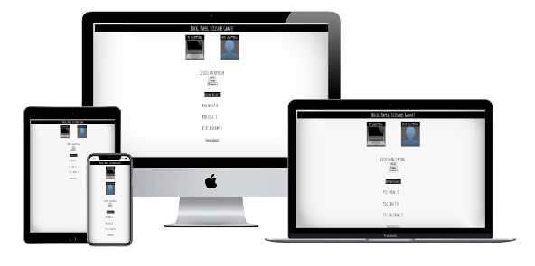
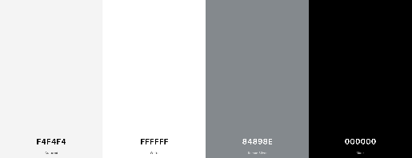
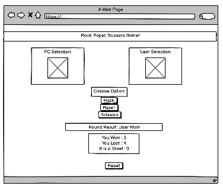
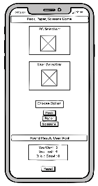
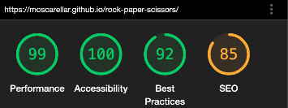

# Rock, Paper, Scissorss

This is the site for Rock, Paper, Scissors. Is deigned to be responsive and simple easy to use. This website was created with the purpose of completing the second Project of Code Institute Software Developer program.
Find the  website [here](https://moscarellar.github.io/rock-paper-scissors).

## Table of Contents

* [User Experience (UX)](#User-Experience-(UX))
* [Design](#Design)
* [Features](#Features)
* [Technologies](#technologies)
* [Testing](#Testing)
* [Deployment](#Deployment)
* [Acknowledgements & Credit](#Credits)

## User Experience (UX)

### User Story
*First Time Visitor Goals 
*As a First Time user, I want to easily understand the layout of the site. 
*As a First Time user, I want to be able to easily understand the scores.

*Returning Visitor Goals 
*I want the layout to remain as simple and minimalistic as possible so I can recognize the features I have already identified on my first visit.

### Structure

The website consists of 1 HTML page with a very clean and simple layout. Buttons and score table are easy to identify and self explanatory. 

## Design

### Imagery
As soon as we open the website we will find images corresponding to USER and COMPUTER sections. After triggering the game the images will change depending on USER and COMPUTER choices.
I decided to use very known images (emojis) in order to give the feeling of "I know this imagery" to the user, so they can easily relate to the website.
### Fonts
The fonts used throughout the website are Monoton and Rubik. 
I used 1 font for the logo and 1 font for the site. There is no text-transform applied as we intended to keep logo with capital and lowercase letters.

### Color Scheme
Our color pallete is created of the following colors. 

###Wireframes
Balsamiq was used in order to sketch the layout of the website.

## Features

Emoji Images
I decided to use emoji imagery as it is broadly known to users and they will be able to relate easily to them. This will result in a faster identification of icons and more appealing.

Buttons
They are simple and easy to find. User can choose one of the 3 option (rock, paper, scissors) and there is an adittional Reset button. This botton will reset scores to 0.

Scoreboard
Scoreborard is simple and easy to check. After each round the SB will be automatically updated so user can easily keep track of results.  

 
Rules Link
Pop up Window

## Technologies

### 
* HTML5
* CSS3
* JavaScript

These are the 3 technologies I used to create this site.

### Other sources to create the site

1. Google Fonts

2. Font Awesome
3. Gitpod
4. GitHub
5. Balsamiq
7. Formatting
    * The CSS file was passed through https://beautifier.io/ for a consistent formatting throughout the code. 

## Testing
Testing was important in order to ensure that the site was responsive in different screen sizes. Tested on Chrome, Safari (Computer Screens and Mobile). 
I ensured images were not overlapping.

HTML: No errors were returned when passing through the official W3C validator.

CSS: No errors were found when passing through the official W3C validator.

Lighthouse

Bugs
The main bugs issues were around the responsiveness on mobile phones and smaller screens. Images would layout one over the other, when the intention was each image to occupy its own space. Differently from previous project, I found easily to work with Flex feature on CSS. This made my workflow much easier.

## Deployment
Site was deployed to GitHub.
In order to deploy I followed instructions in tutorials offered by Code Institute. Choosing the right option in the source section (Main/Master Branch).

I began to apply (to some extent) constant commits for the website. However I believe there is the need to do it more often. I believe as a beginner this practice will be more and more common in future projects.

## Credits

It is very important to mention, even due no direct copy of code was done, the CI Love Running Project gave me a strong base to develop this page. This is my first time working on a web site development, so it is natural this is my main reference. However, I tried to make variations of this code so I could show control and understanding over the code I was using.

Images were taken fromFind the  website [Unsplash](https://unsplash.com)

Most of my doubts were already answered on Slack Community.