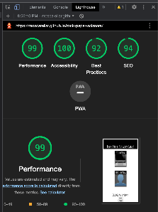

# Rock, Paper, Scissorss

This is the site for Rock, Paper, Scissors. Is deigned to be responsive and simple easy to use. This website was created with the purpose of completing the second Project of Code Institute Software Developer program.
Find the  website [here](https://moscarellar.github.io/rock-paper-scissors).

## Table of Contents

* [User Experience (UX)](#User-Experience-(UX))
* [Design](#Design)
* [Features](#Features)
* [Technologies](#technologies)
* [Testing](#Testing)
* [Deployment](#Deployment)
* [Acknowledgements & Credit](#Credits)

## User Experience (UX)

### User Story
*First Time Visitor Goals 
*As a First Time user, I want to easily understand the layout of the site. 
*As a First Time user, I want to be able to easily understand the scores.

*Returning Visitor Goals 
*I want the layout to remain as simple and minimalistic as possible so I can recognize the features I have already identified on my first visit.

### Structure

The website consists of 1 HTML page with a very clean and simple layout. Buttons and score table are easy to identify and self explanatory. 

## Design

### Imagery 
The main images when accessing the website are descriptive of main attractions and offers in The Film Society. The images scale adapt to the screen depending on its size.
### Fonts
The fonts used throughout the website are Monoton and Rubik. 
I used 1 font for the logo and 1 font for the site. There is no text-transform applied as we intended to keep logo with capital and lowercase letters.

### Color Scheme
Our color pallete is created of the following colors. 

These colors were taken from the main hero image. As this image is used as the hero image, we used these colors for the logo and color palette.

###Wireframes
Balsamiq was used in order to sketch the layout of the website.

## Features

Logo - Nav Bar
The Logo I chose is a strong, bold logo and has the intention to set a classy theme, however, with some colors that make reference to the Neon Entrance visible in the Hero Image. It is visible on all pages and it’s function is to bring the user back to the home page.

The Navigation Bar is fully responsive and includes links to Home page, Gallery and Contact page.

Landing Page Image
The Landing Page includes an image with an animation and a text box that displays right away a message with a call to action to join The Film Society. 

Main Activities held on The Film Society are displayed and separated in three parts so it can be easily identified by the eye.

 
Footer
Footer includes icons to most known social media accounts. They open on a new tab so it does not compromise navigation. 

Gallery 
This section includes pictures with representation of all activities held in The Film Society. It has the intention to show it is not only a place to gather for screenings, but there is actually a community that interacts in other activities.

Contact
The Contact page is the main point of contact between the user and the institution. We find a form in which the user will be able to Join the Film Society, or ask to be included or inquiry about any other of the activities is interested in.

I have included a Map and Contact Information such as email and telephone numbers.

## Technologies

### 
* HTML5
* CSS3
* JavaScript

These were the 3 languages I used to create this site.

### Other sources to create the site

1. Google Fonts

2. Font Awesome
3. Gitpod
4. GitHub
5. Balsamiq
6. OnlineImageCompressor
7. Formatting
    * The css file was passed through https://beautifier.io/ for a consistent formatting throughout the code. 

## Testing
Testing was important in order to ensure that the site was responsive in different screen sizes. Tested on Chrome, Safari (Computer Screens and Mobile). 
I ensured all links were working fine.

HTML: No errors were returned when passing through the official W3C validator. For gallery site there is a warning for line 33, asking to include a h element. However, for a better aesthetic I decided not to include it.

CSS: No errors were found when passing through the official W3C validator.

Lighthouse
Initially, lighthouse gave poor results, however, after following recommendations of running lighthouse in Incognito Window, scores improved dramatically. As it is mentioned in the course tutorial that Accessibility Scores are the most important, I feel very confident about my first project.

Bugs
The main bugs issues were around the responsiveness on mobile phones and smaller screens. Images would layout one over the other, when the intention was each image to occupy its own space. 
After rewatching tutorials and using Google as a tool to debug my project, I began to understand dynamics for elements much better, specially around Clear:Both and Overflow:Hidden. Also given each element the appropriate % rate to keep it consistent with the screen. I believe this was the biggest challenge/learning in this project.

## Deployment
Site was deployed to GitHub.
In order to deploy I followed instructions in tutorials offered by Code Institute. Choosing the right option in the source section (Main/Master Branch).

I began to apply (to some extent) constant commits for the website. However I believe there is the need to do it more often. I believe as a beginner this practice will be more and more common in future projects.

## Credits

It is very important to mention, even due no direct copy of code was done, the CI Love Running Project gave me a strong base to develop this page. This is my first time working on a web site development, so it is natural this is my main reference. However, I tried to make variations of this code so I could show control and understanding over the code I was using.

Images were taken fromFind the  website [Unsplash](https://unsplash.com)

Most of my doubts were already answered on Slack Community.